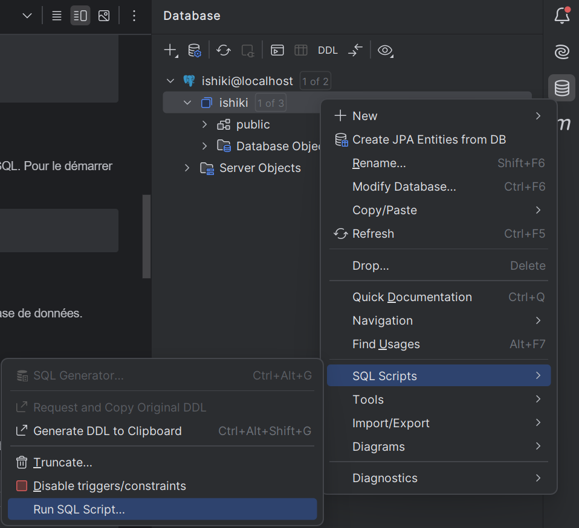

MOUTUIDINE Mourchid / TORDJMAN Aura / MAUZE Louis - MIN1
-- -

# 📘 Projet : App D'apprentissage Java Spring Boot avec PostgreSQL

## 📝 Description
Ce projet est une application Java Spring Boot utilisant une base de données PostgreSQL. Le projet inclut :
- Une base de données initialisée via des scripts SQL.
- Une configuration Docker pour gérer le conteneur de la base de données.

## 🗂️ Arborescence du projet
```
.
├── initdb/
│   ├── 1_create_tables.sql       # Script pour créer les tables
│   ├── 2_fill_database.sql       # Script pour remplir la base de données
├── src/
│   ├── main/
│   │   ├── java/                 # Code source Java
│   │   ├── resources/
│           ├── static/
│           ├── templates/
│   │       ├── application.properties   # Configuration de l'application
│   ├── test/                     # Tests unitaires
├── docker-compose.yml            # Configuration Docker pour PostgreSQL
├── pom.xml                       # Dépendances Maven
└── README.md                     # Ce fichier
```

---

## 🛠️ Prérequis
- **Java** (version 17 ou plus recommandée)
- **Maven** (pour la gestion des dépendances)
- **Docker et Docker Compose** (pour exécuter PostgreSQL)

---

## 🚀 Installation

Tout d'abord :
```bash
mvn clean install
```
Ensuite,
### 1. Configurer fichier .env
- Renommer le fichier .env.sample --> .env
- Remplissez avec vos valeurs
```bash
DATABASE_USER=<votre user>
DATABASE_PASSWORD=<votre pass>
DATABASE_NAME=<votre nom de db>
```

### 2. Lancer le conteneur PostgreSQL
- Le fichier `docker-compose.yml` configure un conteneur PostgreSQL. Pour le démarrer :
```bash
docker-compose up
```
- Cela va :
    - Démarrer un conteneur PostgreSQL.
    - Monter les scripts SQL dans le conteneur pour initialiser la base de données.

### 3. Initialiser la base de données
- Méthode 1 : Via IntellIJ : sélectionnez les scripts à exécuter
  - 
- Méthode 2 : Assurez-vous que le conteneur PostgreSQL est en cours d'exécution. Ensuite :
```bash
docker exec -i <NOM_DU_CONTENEUR_DOCKER> psql -U <UTILISATEUR> -d <NOM_DB> < initdb/1_create_tables.sql
docker exec -i <NOM_DU_CONTENEUR_DOCKER> psql -U <UTILISATEUR> -d <NOM_DB> < initdb/2_fill_database.sql
```

### 4. Lancer l'application Spring Boot
- Utilisez Maven pour démarrer le serveur :
```bash
mvn spring-boot:run
```

---

## 🧪 Tester l'application
- L'application expose plusieurs endpoints API que vous pouvez tester via **Postman**, **cURL**, ou un navigateur.
- Vous pouvez tester aussi via SwaggerUI, via ce lien :
```bash
http://localhost:8080/swagger-ui/index.html
```

---

## 📦 Fonctionnalités principales
1. Une base de données relationnelle PostgreSQL avec des scripts SQL pour l'initialisation.
2. Une application Java Spring Boot respectant les meilleures pratiques.
3. Gestion des entités : Fields, Courses, Cards, Users.
4. Endpoints RESTful pour interagir avec les données(Login, Register, Like, Dislike, CRUD, etc...).

---

## ⚙️ Développement

### Ajouter une nouvelle dépendance
1. Modifier le fichier `pom.xml`.
2. Exécuter la commande :
   ```bash
   mvn clean install
   ```


---

## 🧹 Nettoyage
Pour arrêter le conteneur PostgreSQL :
```bash
docker-compose down
```
